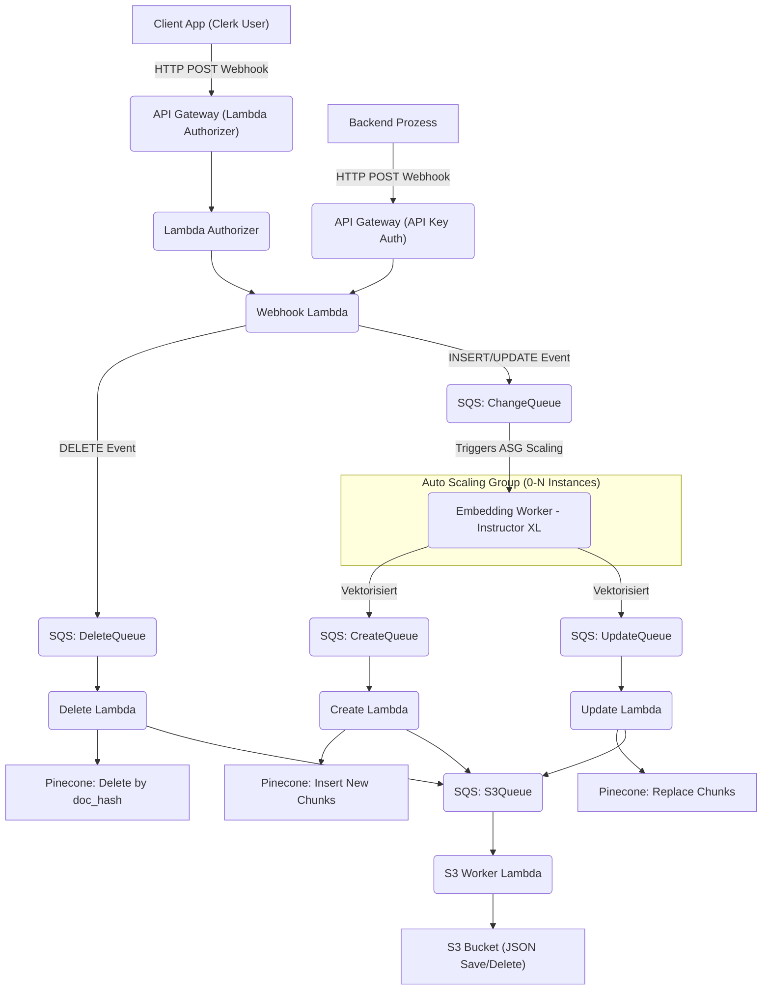

---

# 📊 Systemarchitektur

### Frontend

- **Astro** Framework für statische Seiten.
- **Clerk** für User Authentication.
- **Hosting** über **AWS S3** + **CloudFront**.
- **Domain Management** über **Route53**.
- **SSL** über **ACM Zertifikate**.
- **Uploader und Dateieditor** im Admin Dashboard, der Dateien verarbeitet und automatisch an die Webhook übermittelt.
- **Datenbank-Editor** im Admin Dashboard, der gehashte Einträge automatisch an die Webhook sendet.

### Backend

- **Sprache:** Alles in **Go**, außer dem Embedding Worker, der in **Python** entwickelt ist.
- **API Gateway**:
  - **Secure API Gateway** mit Lambda Authorizer für Clerk Token Validation.
  - **Simple API Gateway** mit API-Key Zugriff für serverseitige interne Prozesse.
- **Webhook Lambda**:
  - Validiert Requests.
  - Leitet Operationen (INSERT/UPDATE/DELETE) gezielt über SQS Queues weiter.
- **Auth Lambda**:
  - Verifiziert Clerk JWTs für die Secure API Gateway Zugriffe.
- **SQS Queues**:
  - ChangeQueue (für den Embedding Worker)
  - CreateQueue (für neu erzeugte Embeddings)
  - UpdateQueue (für aktualisierte Embeddings)
  - DeleteQueue (für Löschvorgänge ohne Embedding Worker)
  - S3Queue (für paralleles Speichern/Löschen in S3)
  - DeadLetterQueue Pinecone (Fehlerbehandlung Pinecone-Prozesse)
  - DeadLetterQueue S3 (Fehlerbehandlung S3-Operationen)

- **Embedding Worker** (FastAPI Python Service):
  - Modell: `hkunlp/instructor-xl`
  - Bereitstellung über EC2 Auto Scaling Group (ASG).
  - Keine laufenden Instanzen im Idle, automatische Skalierung bei Last.
  - Unterstützung mehrerer Modelle (Small/Large Variants).

- **Create Lambda / Update Lambda / Delete Lambda**:
  - Schreiben, Aktualisieren und Löschen von Embeddings in Pinecone.
  - Senden der Events zusätzlich an die S3Queue.

- **S3 Worker Lambda**:
  - Bearbeitet Create/Update/Delete Events aus der S3Queue.
  - Schreibt oder löscht entsprechende JSON-Dateien im S3 Bucket.

- **Pinecone**:
  - Speicherung der Vektorrepräsentationen für schnelle semantische Suchen.

- **Optional**:
  - RDS PostgreSQL für Rohdaten.
  - S3 Buckets für Dateiuploads und Embedding-Backups.

### Infrastruktur

- Vollständig via **Terraform**.
- CI/CD Pipelines via **GitHub Actions**:
  - Lambda Deployments
  - Embedding Worker Docker Build & Push
  - Frontend Deployment
  - Auth Lambda Deployment
  - Terraform Deployment
- Deployment nach Änderung an den jeweiligen `paths` getriggert.

### Monitoring & Logging

- **CloudWatch Logs** für alle Lambdas und EC2 Services.
- Separate LogGroups.
- Fehlerbehandlung über eigene DeadLetterQueues.
- CloudWatch Alarme für EC2 Auto Scaling und Queue-Tiefe.

---

# 📊 Systemarchitektur Übersicht



---

# 🔢 Projektstruktur

```plaintext
/bloomweaver
├── terraform/
│   ├── api_gateway/
│   │   ├── secure_api_gateway/
│   │   ├── simple_api_gateway/
│   ├── lambdas/
│   │   ├── webhook/
│   │   ├── create/
│   │   ├── update/
│   │   ├── delete/
│   │   ├── s3-worker/
│   │   ├── auth/
│   ├── sqs/
│   │   ├── change-queue/
│   │   ├── create-queue/
│   │   ├── update-queue/
│   │   ├── delete-queue/
│   │   ├── s3-queue/
│   │   ├── deadletter-queue-pinecone/
│   │   ├── deadletter-queue-s3/
│   ├── ec2/
│   │   ├── auto_scaling_group/
│   │   ├── launch_template/
│   │   ├── scaling_policies/
│   ├── s3_frontend/
│   ├── s3_upload/
│   ├── cloudfront/
│   ├── rds/
├── lambdas/
│   ├── webhook/
│   ├── create/
│   ├── update/
│   ├── delete/
│   ├── s3-worker/
│   ├── auth/
├── embedding-worker/
│   ├── Dockerfile
│   ├── app/
│   ├── variants/
│   │   ├── small-model/
│   │   ├── large-model/
├── frontend/
│   ├── public/
│   ├── src/
├── .github/
│   ├── workflows/
│   │   ├── lambda-webhook.yml
│   │   ├── lambda-create.yml
│   │   ├── lambda-update.yml
│   │   ├── lambda-delete.yml
│   │   ├── lambda-s3-worker.yml
│   │   ├── lambda-auth.yml
│   │   ├── embedding-worker.yml
│   │   ├── frontend-deploy.yml
│   │   ├── terraform-apply.yml
```

---

# 📕 Infrastruktur-Komponenten

- **Secure API Gateway** nutzt Auth Lambda für Clerk Token Prüfung.
- **Simple API Gateway** für serverseitige interne Calls per API Key.
- **Webhook Lambda** verarbeitet alle Events und routed sie.
- **Embedding Worker** skaliert automatisch basierend auf Last.
- **Create/Update/Delete Lambdas** kommunizieren mit Pinecone und senden parallele Events an die S3Queue.
- **S3 Worker Lambda** hält den S3 Speicher synchron.
- **Zwei getrennte DeadLetterQueues** für Pinecone- und S3-Fehler.
- **GitHub Actions** verwalten alle Build/Deploy Aufgaben.

---
