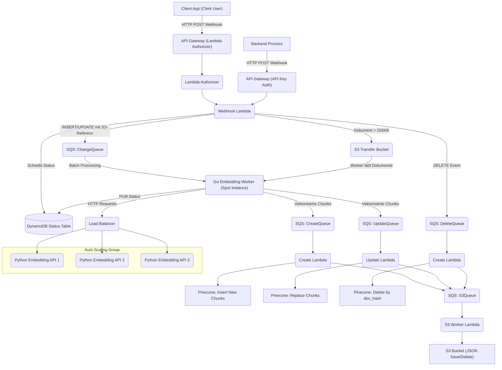

---

# 📊 Systemarchitektur

### Frontend

- **Astro** Framework für statische Seiten.
- **Clerk** für User Authentication.
- **Hosting** über **AWS S3** + **CloudFront**.
- **Domain Management** über **Route53**.
- **SSL** über **ACM Zertifikate**.
- **Uploader und Dateieditor** im Admin Dashboard, der Dateien verarbeitet und automatisch an die Webhook übermittelt.
- **Datenbank-Editor** im Admin Dashboard, der gehashte Einträge automatisch an die Webhook sendet.

### Backend

- **Sprache:** Alles in **Go**, außer dem Embedding FastAPI Service, der in **Python** entwickelt ist.
- **API Gateway**:
  - **Secure API Gateway** mit Lambda Authorizer für Clerk Token Validation.
  - **Simple API Gateway** mit API-Key Zugriff für serverseitige interne Prozesse.
- **Webhook Lambda**:
  - Validiert Requests.
  - Generiert UUID für Dokumente und lädt große Dokumente (>256KB) in den S3 Transfer Bucket.
  - Speichert Status für jedes Dokument in DynamoDB (doc_id, status, timestamp).
  - Leitet Operationen (INSERT/UPDATE/DELETE) mit Referenz zum S3-Objekt gezielt über SQS Queues weiter.
- **Auth Lambda**:
  - Verifiziert Clerk JWTs für die Secure API Gateway Zugriffe.
- **S3 Transfer Bucket**:
  - Temporäre Speicherung großer Dokumente (>256KB), die nicht direkt über SQS übertragen werden können.
  - Workers laden Dokumente von hier, statt direkt aus der Queue.
- **DynamoDB Document Status Table**:
  - Speichert aktuellen Status jedes Dokuments (CREATE, UPDATE, DELETE)
  - Ermöglicht Worker-Optimierung und verhindert veraltete Dokument-Verarbeitung
  - Primary Key: doc_id
  - Zusätzliche Attribute: status, last_updated_at, ttl
- **SQS Queues**:
  - ChangeQueue (für den Embedding Worker, enthält S3-Referenzen)
  - CreateQueue (für neu erzeugte Embeddings)
  - UpdateQueue (für aktualisierte Embeddings)
  - DeleteQueue (für Löschvorgänge ohne Embedding Worker)
  - S3Queue (für paralleles Speichern/Löschen in S3)
  - DeadLetterQueue Pinecone (Fehlerbehandlung Pinecone-Prozesse)
  - DeadLetterQueue S3 (Fehlerbehandlung S3-Operationen)

- **Embedding Worker** (Go Service):
  - Manuell, per Cron-Job oder bei hohem SQS-Volumen gestartet
  - Wartet auf die Bereitschaft der Python Embedding API
  - Prozessiert SQS Messages in Batches aus der ChangeQueue
  - Prüft in DynamoDB den aktuellen Status des Dokuments vor der Verarbeitung
  - Führt das Chunking der Dokumente durch
  - Nutzt große Spot-Instances für kostengünstige Verarbeitung
  - Bei Absturz werden Messages durch SQS Visibility Timeout zurück in die Queue gelegt
  - Verwendet großzügigen SQS Visibility Timeout für die Batch-Verarbeitung
  - Fährt automatisch herunter, wenn die Queue leer ist

- **Embedding API** (Python FastAPI Service):
  - Modell: `hkunlp/instructor-xl`
  - Bereitstellung über Load Balancer mit EC2 Auto Scaling Group (ASG)
  - Wird zusammen mit dem Go Worker gestartet und skaliert
  - Führt die eigentliche Berechnung der Embeddings durch
  - Unterstützung mehrerer Modelle (Small/Large Variants)
  - ASG skaliert basierend auf Last herunter, wenn keine Anfragen mehr kommen

- **Create Lambda / Update Lambda / Delete Lambda**:
  - Schreiben, Aktualisieren und Löschen von Embeddings in Pinecone.
  - Senden der Events zusätzlich an die S3Queue.

- **S3 Worker Lambda**:
  - Bearbeitet Create/Update/Delete Events aus der S3Queue.
  - Schreibt oder löscht entsprechende JSON-Dateien im S3 Bucket.

- **Pinecone**:
  - Speicherung der Vektorrepräsentationen für schnelle semantische Suchen.

- **Optional**:
  - RDS PostgreSQL für Rohdaten.
  - S3 Buckets für Dateiuploads und Embedding-Backups.

### Infrastruktur

- Vollständig via **Terraform**.
- CI/CD Pipelines via **GitHub Actions**:
  - Lambda Deployments
  - Go Worker Docker Build & Push
  - Python Embedding API Docker Build & Push
  - Frontend Deployment
  - Auth Lambda Deployment
  - Terraform Deployment
- Deployment nach Änderung an den jeweiligen `paths` getriggert.

### Monitoring & Logging

- **CloudWatch Logs** für alle Lambdas und Services.
- Separate LogGroups.
- Fehlerbehandlung über eigene DeadLetterQueues.
- CloudWatch Alarme für Queue-Tiefe und Job-Ausführung.

---

# 📊 Systemarchitektur Übersicht



---

# 🔢 Projektstruktur

```plaintext
/bloomweaver
├── terraform/
│   ├── api-apigateway-key.tf
│   ├── backend.tf
│   ├── cloudfront.tf
│   ├── dynamodb-document-status.tf
│   ├── ec2-spot-worker.tf
│   ├── ec2-asg-api.tf
│   ├── load-balancer.tf
│   ├── lambda-auth.tf
│   ├── lambda-create.tf
│   ├── lambda-delete.tf
│   ├── lambda-s3-worker.tf
│   ├── lambda-update.tf
│   ├── lambda-webhook.tf
│   ├── providers.tf
│   ├── s3-data-upload.tf
│   ├── s3-frontend.tf
│   ├── s3-vectors.tf
│   ├── sqs-change-queue.tf
│   ├── sqs-create-queue.tf
│   ├── sqs-deadletter-s3.tf
│   ├── sqs-delete-queue.tf
│   ├── sqs-s3-queue.tf
│   ├── sqs-update-queue.tf
│   ├── variables.tf
├── lambdas/
│   ├── webhook/
│   ├── create/
│   ├── update/
│   ├── delete/
│   ├── s3-worker/
│   ├── auth/
├── embedding-worker/
│   ├── Dockerfile
│   ├── main.go
│   ├── chunker/
│   ├── api-client/
├── embedding-api/
│   ├── Dockerfile
│   ├── app/
│   ├── variants/
│   │   ├── small-model/
│   │   ├── large-model/
├── scripts/
│   ├── start-worker.sh
│   ├── monitor-queue.sh
│   ├── shutdown-resources.sh
├── frontend/
│   ├── public/
│   ├── src/
├── .github/
│   ├── workflows/
│   │   ├── lambda-webhook.yml
│   │   ├── lambda-create.yml
│   │   ├── lambda-update.yml
│   │   ├── lambda-delete.yml
│   │   ├── lambda-s3-worker.yml
│   │   ├── lambda-auth.yml
│   │   ├── go-worker.yml
│   │   ├── python-api.yml
│   │   ├── frontend-deploy.yml
│   │   ├── terraform-apply.yml
```

---

# 📕 Infrastruktur-Komponenten

- **Terraform Struktur** ist flach organisiert mit funktionalen Dateien statt verschachtelten Modulen:
  - API Gateway mit API-Key Authentifizierung (`api-apigateway-key.tf`)
  - Lambda Funktionen in einzelnen Dateien (`lambda-*.tf`)
  - SQS Queues in funktionalen Dateien (`sqs-*.tf`)
  - EC2 Spot-Instance für Go Worker (`ec2-spot-worker.tf`)
  - EC2 ASG für Python API (`ec2-asg-api.tf`)
  - Load Balancer für die Python API (`load-balancer.tf`)
  - S3 Buckets für verschiedene Anwendungsfälle (`s3-*.tf`)
  - DynamoDB für Dokumentstatus-Tracking (`dynamodb-document-status.tf`)
- **Secure API Gateway** nutzt Auth Lambda für Clerk Token Prüfung.
- **Simple API Gateway** für serverseitige interne Calls per API Key.
- **Webhook Lambda** verarbeitet alle Events, aktualisiert DynamoDB und routed sie.
- **DynamoDB** speichert den aktuellen Status jedes Dokuments für Optimierung.
- **Go Embedding Worker** prozessiert Dokumente in Batches mit Multi-Threading, führt Chunking durch und fährt herunter, wenn Queue leer ist.
- **Python Embedding API** mit ASG hinter Load Balancer berechnet die Vektorrepräsentationen.
- **Create/Update/Delete Lambdas** kommunizieren mit Pinecone und senden parallele Events an die S3Queue.
- **S3 Worker Lambda** hält den S3 Speicher synchron.
- **Zwei getrennte DeadLetterQueues** für Pinecone- und S3-Fehler.
- **GitHub Actions** verwalten alle Build/Deploy Aufgaben.
- **Automatische Shutdown-Logik** für Worker und API bei leeren Queues.

---
