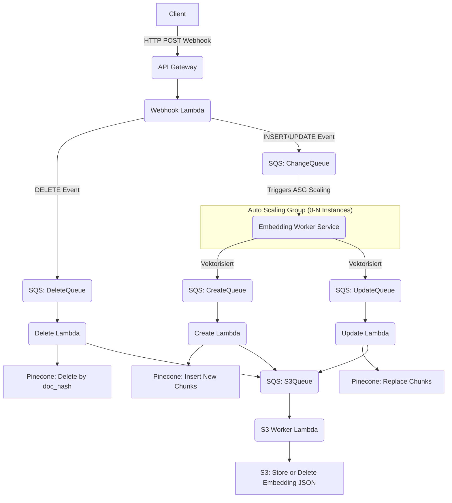

Hier dein Plan – angepasst auf deinen Wunsch: S3-Handling als eigene Pipeline, eigene DeadLetterQueues für Pinecone und S3, keine Strukturänderung bei Change/Create/Update/Delete-Logik:

---

# 📊 Systemarchitektur

### Frontend

- **Astro** Framework für statische Seiten.
- **Clerk** für User Authentication.
- **Hosting** über **AWS S3** + **CloudFront**.
- **Domain Management** über **Route53**.
- **SSL** über **ACM Zertifikate**.
- **Uploader und Dateieditor** im Admin Dashboard, der Dateien verarbeitet und automatisch an die Webhook übermittelt.
- **Datenbank-Editor** im Admin Dashboard, der gehashte Einträge automatisch an die Webhook sendet.

### Backend

- **Sprache:** Alles in **Go**, außer dem Embedding Worker, der in **Python** entwickelt ist.
- **API Gateway** für Webhook Empfang.
- **Webhook Lambda**:
  - Weiterleitung aller Operationen (INSERT/UPDATE/DELETE) über SQS Queuing
- **SQS Queues**:
  - ChangeQueue (für Embedding Worker)
  - CreateQueue (nach Embedding)
  - UpdateQueue (nach Embedding)
  - DeleteQueue (direkt)
  - S3Queue (neu, für S3-Synchronisation)
  - DeadLetterQueue Pinecone (nur für Pinecone-bezogene Fehler)
  - DeadLetterQueue S3 (nur für S3-Handling Fehler)

- **Embedding Worker** (FastAPI Python Service):
  - Modell: `BAAI/bge-small-en-v1.5`
  - Deployment über EC2 Auto Scaling Group (ASG)
  - Kostenoptimierte Skalierung: 0 Instanzen im Idle, auto-skalierend bei Last
  - Multiple Worker-Typen möglich (z.B. small/large embedding models)

- **Create Lambda / Update Lambda / Delete Lambda**:
  - Schreiben/Updaten/Löschen der Embeddings in Pinecone
  - Parallel Push der Event-Daten an **S3Queue**

- **S3 Worker Lambda**:
  - Holt sich Events aus der S3Queue
  - Führt entsprechend `PUT` (create/update) oder `DELETE` Operationen auf dem S3 Bucket aus.

- **Pinecone** als Vektordatenbank
- **Optional**: RDS PostgreSQL für Rohdaten + S3 für Dateiuploads und Embedding-Backups.

### Infrastruktur

- Komplett via **Terraform** gebaut.
- CI/CD Pipelines mit **GitHub Actions**:
  - Lambdas (webhook, create, update, delete, s3-worker)
  - Embedding Worker (Docker Build + ECR Push)
  - Astro Frontend (S3 Sync + CloudFront Invalidate)
- Deployment getriggert per `paths` in GitHub Actions (nur bei Änderungen)

### Monitoring & Logging

- **CloudWatch Logs** für alle Lambdas und EC2 Services.
- LogGroup Management über Terraform.
- Fehlerhafte Nachrichten über eigene **DeadLetterQueues** (Pinecone und S3 getrennt).
- CloudWatch Alarme für Auto Scaling Trigger.

---

# 📊 Systemarchitektur Übersicht (grafisch)



---

# 🔢 Projektstruktur

```plaintext
/bloomweaver
├── terraform/
│   ├── api_gateway/
│   ├── lambdas/
│   │   ├── webhook/
│   │   ├── create/
│   │   ├── update/
│   │   ├── delete/
│   │   ├── s3-worker/   # neu
│   ├── sqs/
│   │   ├── change-queue/
│   │   ├── create-queue/
│   │   ├── update-queue/
│   │   ├── delete-queue/
│   │   ├── s3-queue/         # neu
│   │   ├── deadletter-queue-pinecone/
│   │   ├── deadletter-queue-s3/
│   ├── ec2/
│   │   ├── auto_scaling_group/
│   │   ├── launch_template/
│   │   ├── scaling_policies/
│   ├── s3_frontend/
│   ├── s3_upload/
│   ├── cloudfront/
│   ├── rds/
├── lambdas/
│   ├── webhook/
│   ├── create/
│   ├── update/
│   ├── delete/
│   ├── s3-worker/   # neu
├── embedding-worker/
│   ├── Dockerfile
│   ├── app/
│   ├── variants/
│   │   ├── small-model/
│   │   ├── large-model/
├── frontend/
│   ├── public/
│   ├── src/
├── .github/
│   ├── workflows/
│   │   ├── lambda-webhook.yml
│   │   ├── lambda-create.yml
│   │   ├── lambda-update.yml
│   │   ├── lambda-delete.yml
│   │   ├── lambda-s3-worker.yml   # neu
│   │   ├── embedding-worker.yml
│   │   ├── frontend-deploy.yml
│   │   ├── terraform-apply.yml
```

---

# 📕 Infrastruktur-Komponenten (angepasst)

- **Webhook Lambda**: delegiert an ChangeQueue oder DeleteQueue
- **Embedding Worker**: erzeugt Embeddings, verteilt auf CreateQueue / UpdateQueue
- **Create/Update/Delete Lambdas**: Verarbeiten Pinecone-Operationen, pushen Events zusätzlich an S3Queue
- **S3 Worker Lambda**: synchronisiert Create/Update/Delete in S3 Bucket
- **Zwei DeadLetterQueues**: getrennte Fehlerbehandlung für Pinecone und S3 Fehler

---
