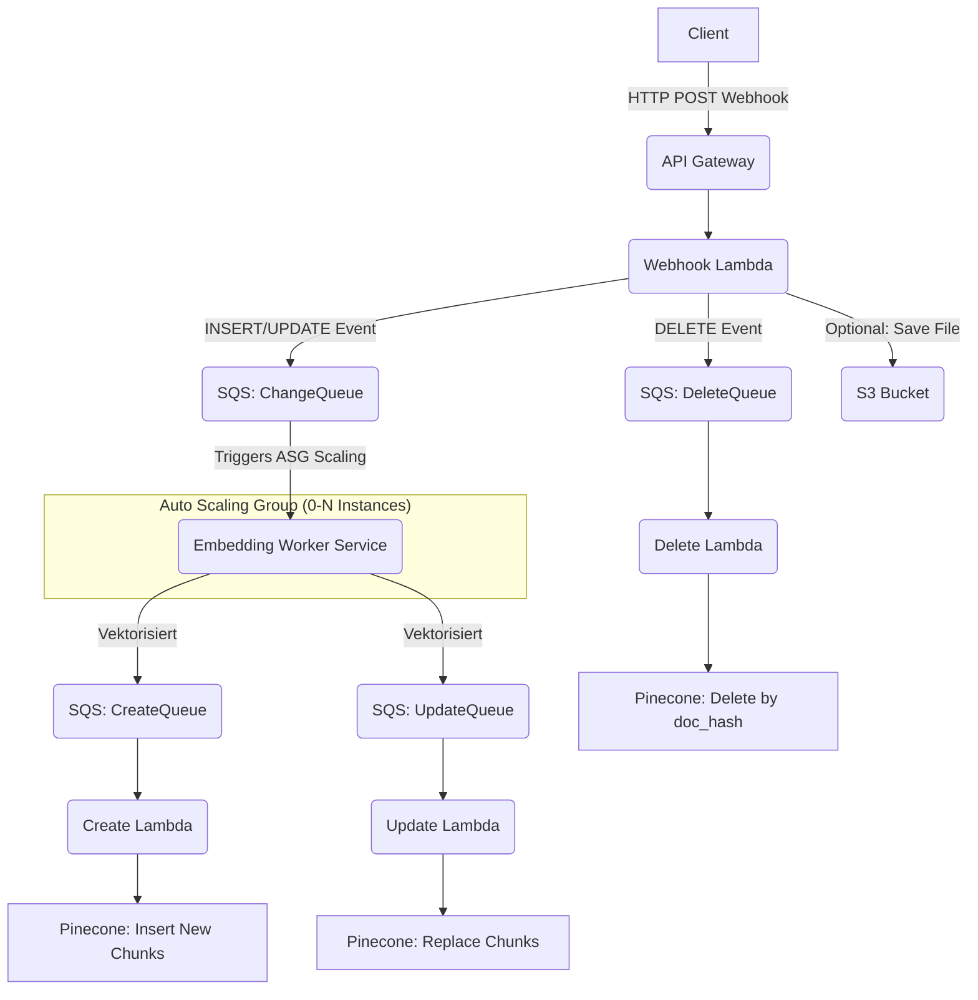

# BloomWeaver - KI Wissensdatenbank Plattform

## 🌐 Projektbeschreibung

BloomWeaver ist eine hochskalierbare, serverlose Plattform zur Verwaltung von Wissensdatenbanken mit KI-Unterstützung. Dokumente und Inhalte werden verarbeitet, vektorisiert und in Pinecone gespeichert, um schnelle semantische Suchen und KI-gestützte Antworten zu ermöglichen.

Dieses Projekt wird als Solo-Projekt von Dennis Diepolder entwickelt.

---

# 📊 Systemarchitektur

### Frontend

- **Astro** Framework für statische Seiten.
- **Clerk** für User Authentication.
- **Hosting** über **AWS S3** + **CloudFront**.
- **Domain Management** über **Route53**.
- **SSL** über **ACM Zertifikate**.
- **Uploader und Dateieditor** im Admin Dashboard, der Dateien verarbeitet und automatisch an die Webhook übermittelt.
- **Datenbank-Editor** im Admin Dashboard, der gehashte Einträge automatisch an die Webhook sendet.

### Backend

- **Sprache:** Alles in **Go**, außer dem Embedding Worker, der in **Python** entwickelt ist.
- **API Gateway** für Webhook Empfang.
- **Webhook Lambda**:
  - Weiterleitung aller Operationen (INSERT/UPDATE/DELETE) über SQS Queuing
- **SQS Queues**:
  - ChangeQueue
  - CreateQueue
  - UpdateQueue
  - DeleteQueue
  - DeadLetterQueue (für Fehlerbehandlung)
- **Embedding Worker** (FastAPI Python Service):
  - Modell: `BAAI/bge-small-en-v1.5`
  - Deployment über EC2 Auto Scaling Group (ASG)
  - Kostenoptimierte Skalierung: 0 Instanzen im Idle, auto-skalierend bei Last
  - Multiple Worker-Typen möglich (z.B. small/large embedding models)
- **Create Lambda / Update Lambda / Delete Lambda**:
  - Schreiben/Updaten/Löschen der Embeddings in Pinecone
- **Pinecone** als Vektordatenbank
- **Optional**: RDS PostgreSQL für Rohdaten + S3 für Dateiuploads

### Infrastruktur

- Komplett via **Terraform** gebaut.
- CI/CD Pipelines mit **GitHub Actions**:
  - Lambdas (webhook, create, update, delete)
  - Embedding Worker (Docker Build + ECR Push)
  - Astro Frontend (S3 Sync + CloudFront Invalidate)
- Deployment getriggert per `paths` in GitHub Actions (nur bei Änderungen)

### Monitoring & Logging

- **CloudWatch Logs** für alle Lambdas und EC2 Services.
- LogGroup Management über Terraform.
- Fehlerhafte Nachrichten über **DeadLetterQueues**.
- CloudWatch Alarme für Auto Scaling Trigger.

---

# 📊 Systemarchitektur Übersicht (grafisch)


---

# 🔢 Projektstruktur

```plaintext
/bloomweaver
├── terraform/
│   ├── api_gateway/
│   ├── lambdas/
│   │   ├── webhook/
│   │   ├── create/
│   │   ├── update/
│   │   ├── delete/
│   ├── sqs/
│   │   ├── change-queue/
│   │   ├── create-queue/
│   │   ├── update-queue/
│   │   ├── delete-queue/
│   │   ├── deadletter-queue/
│   ├── ec2/
│   │   ├── auto_scaling_group/
│   │   ├── launch_template/
│   │   ├── scaling_policies/
│   ├── s3_frontend/
│   ├── s3_upload/
│   ├── cloudfront/
│   ├── rds/
├── lambdas/
│   ├── webhook/
│   ├── create/
│   ├── update/
│   ├── delete/
├── embedding-worker/
│   ├── Dockerfile
│   ├── app/
│   ├── variants/
│   │   ├── small-model/
│   │   ├── large-model/
├── frontend/
│   ├── public/
│   ├── src/
├── .github/
│   ├── workflows/
│   │   ├── lambda-webhook.yml
│   │   ├── lambda-create.yml
│   │   ├── lambda-update.yml
│   │   ├── lambda-delete.yml
│   │   ├── embedding-worker.yml
│   │   ├── frontend-deploy.yml
│   │   ├── terraform-apply.yml
```

---

# 📕 Infrastruktur-Komponenten

## API Gateway + Webhook Lambda

- Validiert Webhook Calls.
- Delegiert je nach `change_type` (insert/update/delete) an entsprechende Queues.

## SQS Queues

- Entkoppeln die Verarbeitungsschritte.
- Retry Management durch DeadLetterQueues.
- Separate Queues für alle Operationstypen (Ändern, Erstellen, Aktualisieren, Löschen).
- Trigger für EC2 Auto Scaling basierend auf Queue-Tiefe.

## Embedding Worker + Auto Scaling

- Splitten von Dokumenten.
- Embedding Generierung über Huggingface Transformers.
- Bereitstellung als REST API auf Docker-basierten EC2 Instanzen.
- Auto Scaling Group (ASG) mit:
  - MinSize=0, DesiredCapacity=0 (kein Idle-Betrieb)
  - MaxSize=5+ (skalierbar je nach Bedarf)
  - Scaling Policy basierend auf SQS Queue-Tiefe
  - Scale-Up bei 1-2+ Nachrichten
  - Scale-Down auf 0 nach 5 Minuten ohne Nachrichten
- Kostenoptimierung: Keine laufenden Instanzen bei keinem Traffic
- Unterstützung mehrerer Embedding Worker Varianten (z.B. für kleine vs. große Modelle)
  - Via separate SQS Queues oder Message-Attribute

## Create/Update/Delete Lambdas

- Schreiben/Updaten/Löschen der Embeddings in Pinecone.
- Einhaltung der Konsistenz durch Doc-Hash Matching.
- Batch-Verarbeitung zur Optimierung der Operationen.

## Pinecone

- Speicherung der Vektor-Repräsentationen.

## RDS + S3 (optional)

- Speicherung von Rohdaten oder originalen Dateien für spätere Referenzierungen.

---

# 🚀 CI/CD Flows

- Webhook Lambda Build/Deploy
- Create Lambda Build/Deploy
- Update Lambda Build/Deploy
- Delete Lambda Build/Deploy
- Embedding Worker Docker Build + Push zu ECR
  - Varianten für verschiedene Embedding-Modelle
- Frontend Astro Build + Sync zu S3
- Terraform Apply nur bei Änderung an Infrastruktur-Code

---

# 📈 Observability (Phase 1)

- CloudWatch Loggroups pro Service
- Fehlerauswertung über DeadLetter Queues
- CloudWatch Alarme für EC2 Auto Scaling
- Metriken für SQS Queue-Tiefe und Verarbeitungszeiten

---

# 🚀 Deployment Prozess (First Boot)

1. Terraform Infrastruktur aufbauen (terraform apply).
2. Webhook, Create, Update und Delete Lambdas bauen und hochladen.
3. Embedding Worker Docker Images bauen und nach ECR pushen.
4. EC2 Launch Template mit UserData Script für Auto-Deployment der Worker konfigurieren.
5. Auto Scaling Group und Scaling Policies einrichten.
6. Astro Frontend bauen und auf S3 synchronisieren.
7. CloudFront Distribution invalidieren.
8. Clerk einrichten für Frontend-Authentication.
9. API Gateway Endpoint an Client übergeben.

---

# 🔒 Security Best Practices

- IAM Rollen mit least-privilege.
- SQS Queues private.
- Pinecone API Keys sicher verwalten.
- Clerk für sichere Authentifizierung der User.
- SSL überall aktiv.
- EC2 Instanzen in privaten Subnets mit Security Groups.

---

# 🚀 Erweiterungspläne

- Spezialisierte Embedding Worker auf GPU Nodes für komplexere Modelle.
- Multimodale Modelle (Text + Bilder).
- Admin Dashboard über Grafana Cloud.
- Automatische Chunk Optimierungen bei Dokumenten-Importen.
- API Gateway Rate Limits pro Kunde.
- Direkter Datenbank-Editor über das Admin Dashboard.
- Upload- und Datei-Editor direkt zum Projektstart.

---

# 👋 Kontakt

Projektleitung: Dennis Diepolder
Technische Leitung: Dennis Diepolder
Lizenz: Privat / Company Internal

---

> **Hinweis:** Dieses Projekt ist modular aufgebaut und kann jederzeit mit minimalem Aufwand um Logging, Monitoring, neue Features und neue Kundenquellen erweitert werden.

