---

# 📊 Systemarchitektur

### Frontend

- **Astro** Framework für statische Seiten.
- **Clerk** für User Authentication.
- **Hosting** über **AWS S3** + **CloudFront**.
- **Domain Management** über **Route53**.
- **SSL** über **ACM Zertifikate**.
- **Uploader und Dateieditor** im Admin Dashboard, der Dateien verarbeitet und automatisch an die Webhook übermittelt.
- **Datenbank-Editor** im Admin Dashboard, der gehashte Einträge automatisch an die Webhook sendet.

### Backend

- **Sprache:** Alles in **Go**, außer dem Embedding Worker, der in **Python** entwickelt ist.
- **API Gateway**:
  - **Secure API Gateway** mit Lambda Authorizer für Clerk Token Validation.
  - **Simple API Gateway** mit API-Key Zugriff für serverseitige interne Prozesse.
- **Webhook Lambda**:
  - Validiert Requests.
  - Generiert UUID für Dokumente und lädt große Dokumente (>256KB) in den S3 Transfer Bucket.
  - Leitet Operationen (INSERT/UPDATE/DELETE) mit Referenz zum S3-Objekt gezielt über SQS Queues weiter.
- **Auth Lambda**:
  - Verifiziert Clerk JWTs für die Secure API Gateway Zugriffe.
- **S3 Transfer Bucket**:
  - Temporäre Speicherung großer Dokumente (>256KB), die nicht direkt über SQS übertragen werden können.
  - Embedding Worker lädt Dokumente von hier, statt direkt aus der Queue.
- **SQS Queues**:
  - ChangeQueue (für den Embedding Worker, enthält S3-Referenzen)
  - CreateQueue (für neu erzeugte Embeddings)
  - UpdateQueue (für aktualisierte Embeddings)
  - DeleteQueue (für Löschvorgänge ohne Embedding Worker)
  - S3Queue (für paralleles Speichern/Löschen in S3)
  - DeadLetterQueue Pinecone (Fehlerbehandlung Pinecone-Prozesse)
  - DeadLetterQueue S3 (Fehlerbehandlung S3-Operationen)

- **Embedding Worker** (FastAPI Python Service):
  - Modell: `hkunlp/instructor-xl`
  - Lädt Dokumente aus dem S3 Transfer Bucket basierend auf Referenzen aus der ChangeQueue.
  - Bereitstellung über EC2 Auto Scaling Group (ASG).
  - Keine laufenden Instanzen im Idle, automatische Skalierung bei Last.
  - Unterstützung mehrerer Modelle (Small/Large Variants).

- **Create Lambda / Update Lambda / Delete Lambda**:
  - Schreiben, Aktualisieren und Löschen von Embeddings in Pinecone.
  - Senden der Events zusätzlich an die S3Queue.

- **S3 Worker Lambda**:
  - Bearbeitet Create/Update/Delete Events aus der S3Queue.
  - Schreibt oder löscht entsprechende JSON-Dateien im S3 Bucket.

- **Pinecone**:
  - Speicherung der Vektorrepräsentationen für schnelle semantische Suchen.

- **Optional**:
  - RDS PostgreSQL für Rohdaten.
  - S3 Buckets für Dateiuploads und Embedding-Backups.

### Infrastruktur

- Vollständig via **Terraform**.
- CI/CD Pipelines via **GitHub Actions**:
  - Lambda Deployments
  - Embedding Worker Docker Build & Push
  - Frontend Deployment
  - Auth Lambda Deployment
  - Terraform Deployment
- Deployment nach Änderung an den jeweiligen `paths` getriggert.

### Monitoring & Logging

- **CloudWatch Logs** für alle Lambdas und EC2 Services.
- Separate LogGroups.
- Fehlerbehandlung über eigene DeadLetterQueues.
- CloudWatch Alarme für EC2 Auto Scaling und Queue-Tiefe.

---

# 📊 Systemarchitektur Übersicht

```mermaid
flowchart TD
    Client["Client App (Clerk User)"] -- HTTP POST Webhook --> SecureAPIGateway("API Gateway (Lambda Authorizer)")
    LocalService["Backend Prozess"] -- HTTP POST Webhook --> SimpleAPIGateway("API Gateway (API Key Auth)")

    SecureAPIGateway --> AuthLambda("Lambda Authorizer")
    AuthLambda --> WebhookLambda("Webhook Lambda")

    SimpleAPIGateway --> WebhookLambda

    WebhookLambda -- DELETE Event --> SQSDeleteQueue("SQS: DeleteQueue")
    WebhookLambda -- Dokument > 256KB --> S3TransferBucket("S3 Transfer Bucket")
    WebhookLambda -- INSERT/UPDATE mit S3-Referenz --> SQSChangeQueue("SQS: ChangeQueue")
    
    subgraph "Auto Scaling Group (0-N Instances)"
    EmbeddingWorker("Embedding Worker - Instructor XL")
    end
    
    SQSChangeQueue -- Triggers ASG Scaling --> EmbeddingWorker
    S3TransferBucket -- Worker lädt Dokumente --> EmbeddingWorker
    EmbeddingWorker -- Vektorisiert --> SQSCreateQueue("SQS: CreateQueue") & SQSUpdateQueue("SQS: UpdateQueue")
    
    SQSCreateQueue --> CreateLambda("Create Lambda")
    SQSUpdateQueue --> UpdateLambda("Update Lambda")
    SQSDeleteQueue --> DeleteLambda("Delete Lambda")
    
    CreateLambda --> PineconeCreate["Pinecone: Insert New Chunks"]
    UpdateLambda --> PineconeUpdate["Pinecone: Replace Chunks"]
    DeleteLambda --> PineconeDelete["Pinecone: Delete by doc_hash"]
    
    CreateLambda --> SQS3Queue("SQS: S3Queue")
    UpdateLambda --> SQS3Queue
    DeleteLambda --> SQS3Queue
    
    SQS3Queue --> S3Lambda("S3 Worker Lambda")
    S3Lambda --> S3Bucket["S3 Bucket (JSON Save/Delete)"]
```



---

# 🔢 Projektstruktur

```plaintext
/bloomweaver
├── terraform/
│   ├── api-apigateway-key.tf
│   ├── backend.tf
│   ├── cloudfront.tf
│   ├── ec2-asg.tf
│   ├── ec2-launch-template.tf
│   ├── lambda-auth.tf
│   ├── lambda-create.tf
│   ├── lambda-delete.tf
│   ├── lambda-s3-worker.tf
│   ├── lambda-update.tf
│   ├── lambda-webhook.tf
│   ├── providers.tf
│   ├── s3-data-upload.tf
│   ├── s3-frontend.tf
│   ├── s3-vectors.tf
│   ├── sqs-change-queue.tf
│   ├── sqs-create-queue.tf
│   ├── sqs-deadletter-s3.tf
│   ├── sqs-delete-queue.tf
│   ├── sqs-s3-queue.tf
│   ├── sqs-update-queue.tf
│   ├── variables.tf
├── lambdas/
│   ├── webhook/
│   ├── create/
│   ├── update/
│   ├── delete/
│   ├── s3-worker/
│   ├── auth/
├── embedding-worker/
│   ├── Dockerfile
│   ├── app/
│   ├── variants/
│   │   ├── small-model/
│   │   ├── large-model/
├── frontend/
│   ├── public/
│   ├── src/
├── .github/
│   ├── workflows/
│   │   ├── lambda-webhook.yml
│   │   ├── lambda-create.yml
│   │   ├── lambda-update.yml
│   │   ├── lambda-delete.yml
│   │   ├── lambda-s3-worker.yml
│   │   ├── lambda-auth.yml
│   │   ├── embedding-worker.yml
│   │   ├── frontend-deploy.yml
│   │   ├── terraform-apply.yml
```

---

# 📕 Infrastruktur-Komponenten

- **Terraform Struktur** ist flach organisiert mit funktionalen Dateien statt verschachtelten Modulen:
  - API Gateway mit API-Key Authentifizierung (`api-apigateway-key.tf`)
  - Lambda Funktionen in einzelnen Dateien (`lambda-*.tf`)
  - SQS Queues in funktionalen Dateien (`sqs-*.tf`)
  - EC2 Auto Scaling Komponenten (`ec2-*.tf`)
  - S3 Buckets für verschiedene Anwendungsfälle (`s3-*.tf`)
- **Secure API Gateway** nutzt Auth Lambda für Clerk Token Prüfung.
- **Simple API Gateway** für serverseitige interne Calls per API Key.
- **Webhook Lambda** verarbeitet alle Events und routed sie.
- **Embedding Worker** skaliert automatisch basierend auf Last.
- **Create/Update/Delete Lambdas** kommunizieren mit Pinecone und senden parallele Events an die S3Queue.
- **S3 Worker Lambda** hält den S3 Speicher synchron.
- **Zwei getrennte DeadLetterQueues** für Pinecone- und S3-Fehler.
- **GitHub Actions** verwalten alle Build/Deploy Aufgaben.

---
